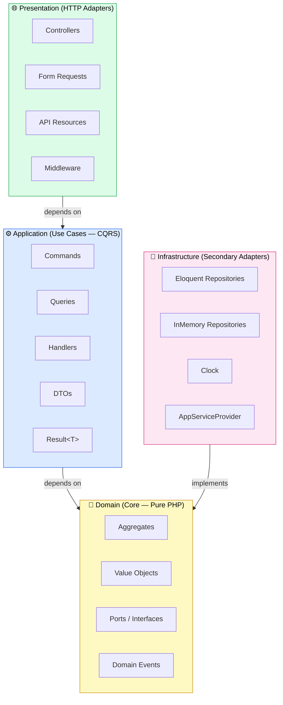

# PHP Laravel Hexagonal Template

A minimal, production-ready Laravel 11 template demonstrating **Hexagonal Architecture** (Ports & Adapters) with CQRS and DDD patterns.

## Architecture



> **Dependency rule:** arrows point inward only. `Domain` has zero framework dependencies — it knows nothing about Laravel, Eloquent, or HTTP. `Infrastructure` implements the `Domain` ports; it never leaks into `Application` or `Presentation`.

| Layer | Namespace | Responsibility |
|-------|-----------|----------------|
| Domain | `src/Domain/` | Business rules, entities, value objects, ports (interfaces) |
| Application | `src/Application/` | Use-case handlers, commands/queries, DTOs, Result type |
| Infrastructure | `src/Infrastructure/` | Adapters — Eloquent, InMemory, events, clock |
| Presentation | `src/Presentation/` | HTTP controllers, form requests, API resources |

## Quick start

```bash
composer install
cp .env.example .env
php artisan key:generate
php artisan migrate          # optional — uses in-memory backend by default
php artisan openapi:generate
php artisan serve
```

Open **http://localhost:8000/api/documentation** for the Swagger UI.

## Running without a database

Set `DB_BACKEND=memory` in `.env` (default). No database setup required.

## Commands

```bash
composer lint              # Laravel Pint auto-format
composer stan              # PHPStan level 9
composer test              # Full Pest suite
composer test:unit         # Unit tests only
composer test:arch         # Architecture boundary tests
composer generate:openapi  # Regenerate OpenAPI JSON
```
